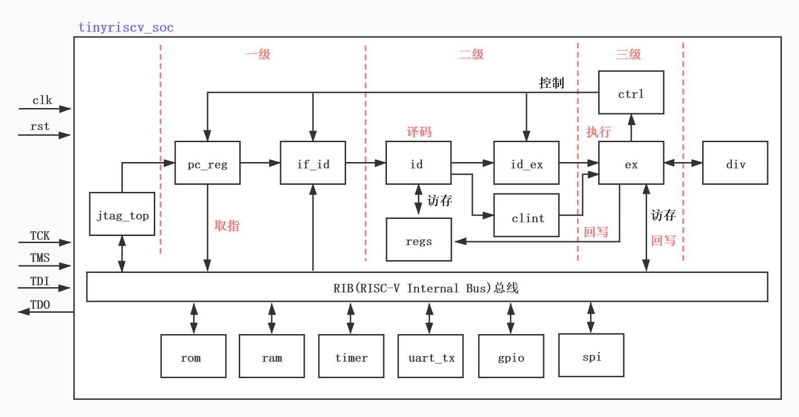
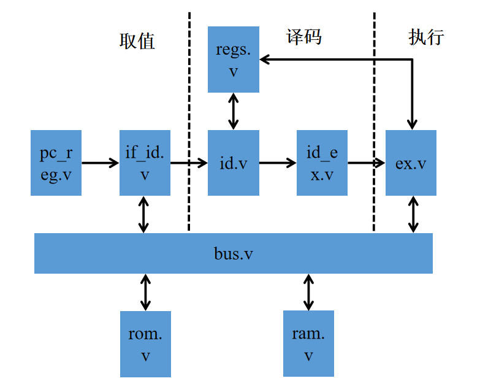
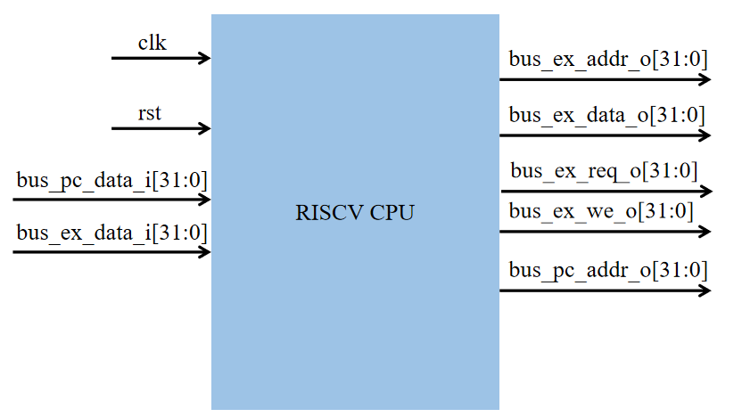
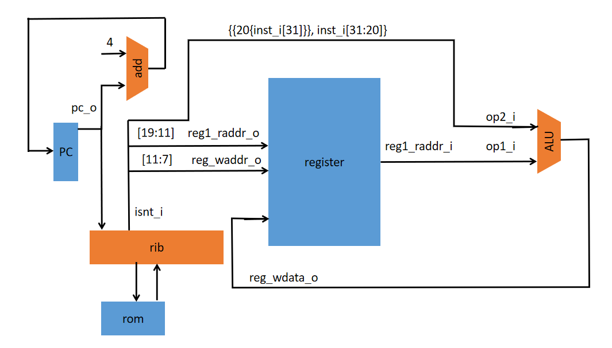
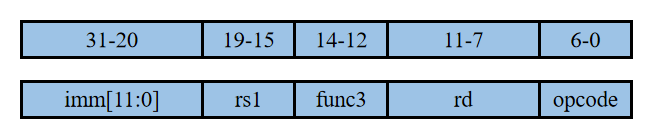

### 1.1、设计目标：

设计一款具有哈弗结构的、32位标量到RISCV架构的处理器。

1. 三级流水线，分别是取值、译码、执行。
2. 哈佛结构，分开的指令、数据接口。
3. 32个32位整数寄存器。
4. 小端模式；



### 1.2、三级流水线：

取值：从指令存储器读出指令，同时确定下一条指令地址；

译码：对取出的指令进行译码，并从通用寄存器里读出要使用寄存器的值；

执行：按照译码阶段给出的操作数、运算类型进行运算。

流水线各个阶段模块对应的文件如下图：

 


### 1.3、CPU接口

 

| 接口名        | 宽度（bit） | 输出/输出 | 作用                            |
| ------------- | ----------- | --------- | ------------------------------- |
| rst           | 1           | 输入      | 复位信号                        |
| clk           | 1           | 输入      | 时钟信号                        |
| bus_pc_data_i | 32          | 输入      | 从指令存储器取得的指令          |
| bus_pc_addr_o | 32          | 输出      | 输出到指令存储器的地址          |
| bus_ex_data_i | 32          | 输入      | 从数据存储器读取的数据          |
| bus_ex_addr_o | 32          | 输出      | 要访问的数据存储器的地址        |
| bus_ex_we_o   | 1           | 输出      | 表示对数据存储器执行读/写操作。 |
| bus_ex_req_o  | 1           | 输出      | 数据存储器请求信号              |
| bus_ex_data_o | 32          | 输出      | 要写入数据存储器的数据          |

### 1.4、第一条指令ori的实现

本项目先实现一条逻辑“或”指令ori，来搭建riscv流水线的架构，其数据流图如下图所示：



后续依次实现逻辑操作。。。，最终实现riscv指令集架构中定义的所有整数指令。

Ori是进行逻辑“或”运算的I类型指令，其指令格式如下：

 

指令格式：

```
ori rd,rs1,imm[11:0]
```

这是一个I类型的指令，其opcode码位7'b0010011，该指令将操作数寄存器rs1中的整数值与12位立即数（进行无符号扩展）进行或运算，结果写回寄存器rd中。

 

### 1.5、一些宏定义：

​		为了提高代码的可读性和易用性，采用的较多的宏定义，均在defines.v文件中。包括复位、使能、数据宽度、指令码等定义。

```Verilog
`define CpuResetAddr 32'h0  //指针寄存器复位后的初始地址

`define RstEnable 1'b0		//复位信号有效
`define RstDisable 1'b1		//复位信号无效
`define ZeroWord 32'h0
`define ZeroReg 5'h0
`define WriteEnable 1'b1
`define WriteDisable 1'b0
`define ReadEnable 1'b1
`define ReadDisable 1'b0
`define True 1'b1
`define False 1'b0

`define Stop 1'b1
`define NoStop 1'b0
`define BUS_ACK 1'b1
`define BUS_NACK 1'b0
`define BUS_REQ 1'b1
`define BUS_NREQ 1'b0


// I type inst
`define INST_TYPE_I 7'b0010011
`define INST_ORI    3'b110

`define INST_NOP    32'h00000001

`define RomNum 4096  // rom depth(how many words)
`define MemNum 4096  // memory depth(how many words)
`define MemBus 31:0
`define MemAddrBus 31:0

`define InstBus 31:0
`define InstAddrBus 31:0

// common regs
`define RegAddrBus 4:0		//regs模块的地址线宽度
`define RegBus 31:0			//regs模块的数据线宽度
`define DoubleRegBus 63:0
`define RegWidth 32			//通用寄存器的宽度
`define RegNum 32        	//通用寄存器的数量
`define RegNumLog2 5		//寻址通用寄存器使用的地址位数

```


### 1.6、使用标准的DFF模块例化生成寄存器有以下好处：

便于全局替换寄存器类型；

便于在寄存器中全局插入延迟；

有使能信号，方便综合工具自动插入寄存器级别的门控时钟以降低功耗；

便于规避if-else不能传播不定态的问题。

gen_dff.v

```Verilog
// 带默认值和控制信号的流水线触发器
module gen_pipe_dff #(parameter DW = 32)(
    input wire clk,
    input wire rst,
    input wire hold_en,
    input wire[DW-1:0] def_val,
    input wire[DW-1:0] din,
    
    output wire[DW-1:0] qout
    );

    reg[DW-1:0] qout_r;

    always @ (posedge clk) begin
        if (!rst | hold_en) begin
            qout_r <= def_val;
        end else begin
            qout_r <= din;
        end
    end

    assign qout = qout_r;

endmodule
```

