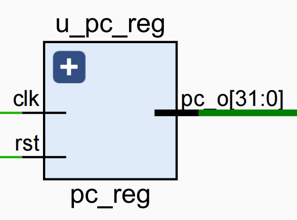
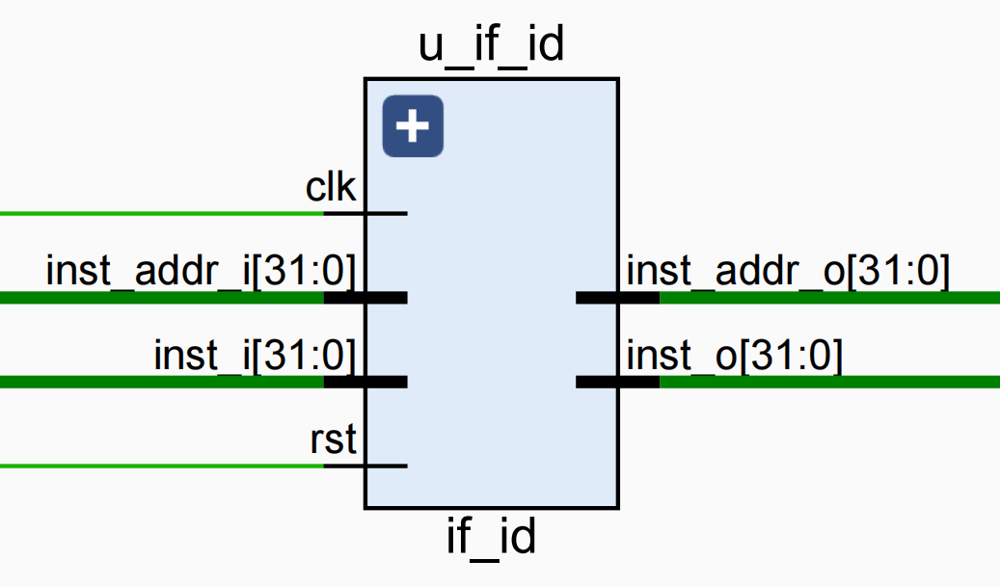
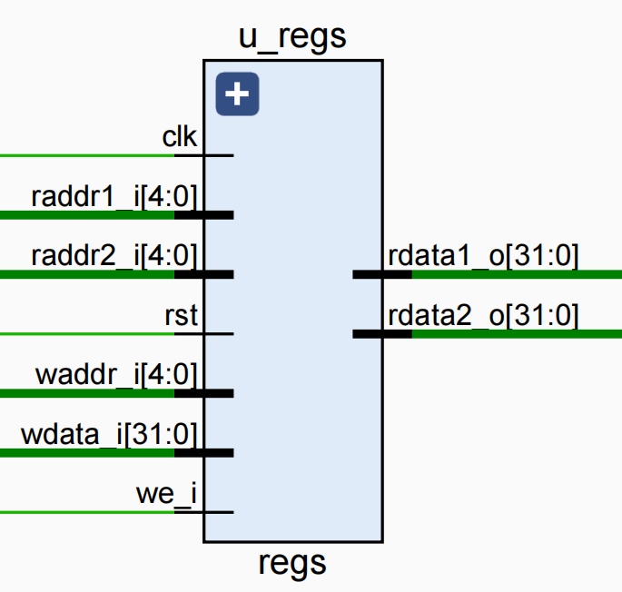
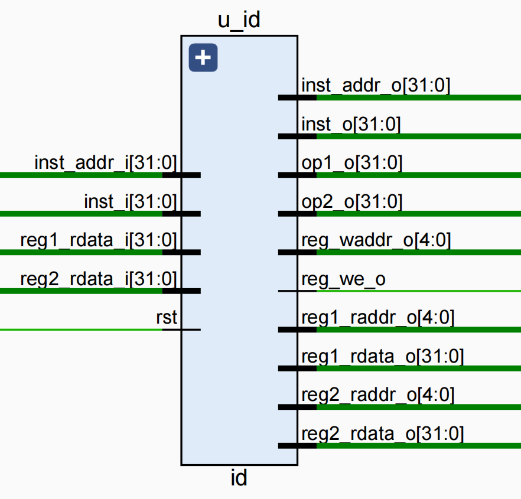
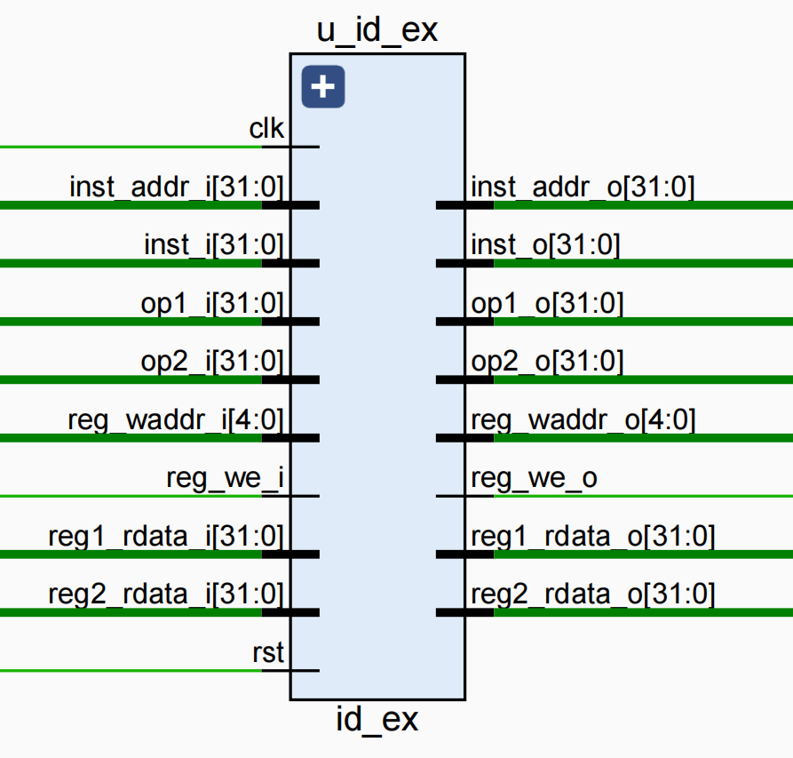

## 2、实现or运算的简易CPU

### 2.1、取值阶段的实现

​		取值阶段取出指令存储器rom中的指令，同时PC值递增，准备取出下一条指令，包含**PC、IF_ID**两个模块。

#### 2.1.1 PC模块

​		PC模块的作用是给出指令地址，PC的值在每周期时钟加4，表示下一条指令地址，因为一条指令是32位的，而RISCV是按字节寻址，一条指令对应4个字节。其接口描述如下：

 

| 接口名     | 宽度(bit) | 输入/输出 | 作用             |
| ---------- | --------- | --------- | ---------------- |
| clk        | 1         | 输入      | 时钟信号         |
| rst        | 1         | 输入      | 复位信号         |
| pc_o[31:0] | 32        | 输出      | 要读取的指令地址 |

```Verilog
`include "defines.v"

// PC寄存器模块
module pc_reg(
    input wire clk,
    input wire rst,
    output reg[`InstAddrBus] pc_o           // PC指针
    );

    always @ (posedge clk) begin
        // 复位
        if (rst == `RstEnable) begin
            pc_o <= `CpuResetAddr;
        // 地址加4
        end else begin
            pc_o <= pc_o + 4'h4;
        end
    end

endmodule
```


#### 1.2 IF_ID模块

​		IF_ID模块的作用是暂时保存取值阶段取得的指令，以及对应的指令地址，并在下一个时钟传递到译码阶段，其接口描述如下：

 

| 接口名            | 作用                         |
| ----------------- | ---------------------------- |
| isnt_i[31:0]      | 取值阶段取得的指令           |
| inst_addr_i[31:0] | 取值阶段取得的指令对应的地址 |
| inst_o[31:0]      | 译码阶段的指令               |
| inst_addr_o[31:0] | 译码阶段的指令对应的地址     |

```Verilog
`include "defines.v"

// 将指令向译码模块传递
module if_id(
    input wire clk,
    input wire rst,
    input wire[`InstBus] inst_i,            // 指令内容
    input wire[`InstAddrBus] inst_addr_i,   // 指令地址

    output wire[`InstBus] inst_o,           // 指令内容
    output wire[`InstAddrBus] inst_addr_o   // 指令地址
    );

    wire[`InstBus] inst;
    gen_pipe_dff #(32) inst_ff(clk, rst, 1'b0, `INST_NOP, inst_i, inst);
    assign inst_o = inst;

    wire[`InstAddrBus] inst_addr;
    gen_pipe_dff #(32) inst_addr_ff(clk, rst, 1'b0, `ZeroWord, inst_addr_i, inst_addr);
    assign inst_addr_o = inst_addr;

endmodule
```


### 2.2、译码

​		译码模块中使用带默认值和控制信号的流水线触发器，来将取值阶段的结果在每个时钟上升沿传递到译码阶段。译码阶段将对指令进行译码，即要给出进行运算的类型，参加运算的操作数。译码阶段包括**regs、id、id_ex**三个模块。

#### 2.2.1、regs模块：

​		该模块实现了32个32位通用整数寄存器，可以同时进行两个寄存器的读操作和一个寄存器的写操作，其接口描述如下：

 

| 接口名         | 作用                                 |
| -------------- | ------------------------------------ |
| we_i           | 写使能信号                           |
| waddr_i[4:0]   | 要写入的寄存器地址                   |
| wdara_i[31:0]  | 要写入的数据                         |
| raddr1_i[4:0]  | 第一个读寄存器端口要读取的寄存器地址 |
| raddr2_i[4:0]  | 第二个读寄存器端口要读取的寄存器地址 |
| rdata1_o[31:0] | 第一个读寄存器端口输出的寄存器值     |
| rdata2_o[31:0] | 第二个读寄存器端口输出的寄存器值     |

```Verilog
`include "defines.v"

// 通用寄存器模块
module regs(
    input wire clk,
    input wire rst,

    // from ex
    input wire we_i,                      // 写寄存器标志
    input wire[`RegAddrBus] waddr_i,      // 写寄存器地址
    input wire[`RegBus] wdata_i,          // 写寄存器数据

    // from id
    input wire[`RegAddrBus] raddr1_i,     // 读寄存器1地址
    input wire[`RegAddrBus] raddr2_i,     // 读寄存器2地址

    // to id
    output reg[`RegBus] rdata1_o,         // 读寄存器1数据
    output reg[`RegBus] rdata2_o         // 读寄存器2数据
    );

    reg[`RegBus] regs[0:`RegNum - 1];

    // 写寄存器
    always @ (posedge clk) begin
        if (rst == `RstDisable) begin
            if ((we_i == `WriteEnable) && (waddr_i != `ZeroReg)) begin
                regs[waddr_i] <= wdata_i;
            end
        end
    end

    // 读寄存器1
    always @ (*) begin
        if (raddr1_i == `ZeroReg) begin
            rdata1_o = `ZeroWord;
        // 如果读地址等于写地址，并且正在写操作，则直接返回写数据
        end else if (raddr1_i == waddr_i && we_i == `WriteEnable) begin
            rdata1_o = wdata_i;
        end else begin
            rdata1_o = regs[raddr1_i];
        end
    end

    // 读寄存器2
    always @ (*) begin
        if (raddr2_i == `ZeroReg) begin
            rdata2_o = `ZeroWord;
        // 如果读地址等于写地址，并且正在写操作，则直接返回写数据
        end else if (raddr2_i == waddr_i && we_i == `WriteEnable) begin
            rdata2_o = wdata_i;
        end else begin
            rdata2_o = regs[raddr2_i];
        end
    end

endmoduleve
```

​		实现写寄存器时，首先判断复位信号是否无效，然后在写使能信号有效，且写操作目的寄存器不等于0的情况下，将输入数据保存到目的寄存器。

​		实现读寄存器时分几个步骤判断：

1. 如果读取的是$0，那么直接给出0；
2. 如果第寄存器端口要读取的目标寄存器与要写入的目的寄存器时同一个寄存器，那么直接将要写入的值作为寄存器端口的输出。
3. 以上情况都不满足则给出读寄存器端口要读取的目标寄存器地址对应的寄存器值。

 

#### 2.2.2、id模块

​		该模块对指令进行译码，得到最终运算的类型、子类型、源操作数1、源操作数2、要写入的目的寄存器地址等信息。Id模块中的电路都是组合逻辑电路，首先根据指令中的特征字段区分指令，对于ori指令而言，需要识别inst_i[6:0]的指令码是否为6’b0010011,且inst_i[14:12]是否为110。要读取的寄存器情况：ori指令读取rs1寄存器的值，对应的地址是inst_i[19:15]，另一个操作数数立即数，所以这是rs2为0。

 

| 接口名             | 作用                                         |
| ------------------ | -------------------------------------------- |
| inst_addr_i[31:0]  | 译码阶段的指令对应的地址                     |
| inst_i[31:]        | 译码阶段的指令                               |
| reg1_rdata_i[31:0] | 从regs输入的第一个读寄存器端口的输入         |
| reg2_rdata_i[31:0] | 从regs输入的第二个读寄存器端口的输入         |
| reg1_raddr_o[4:0]  | regs模块的第一个读寄存器端口的读信号地址     |
| reg2_raddr_o[4:0]  | regs模块的第二个读寄存器端口的读信号地址     |
| reg1_rdata_o[31:0] | 从第一个读寄存器读取的数据送入执行阶段的数据 |
| op1_o[31:0]        | 译码阶段的指令要进行的运算的源操作数1        |
| op2_o[31:0]        | 译码阶段的指令要进行的运算的源操作数2        |
| reg_waddr_o[4:0]   | 译码阶段的指令要写入的目的寄存器地址         |
| reg_we_o           | 译码阶段的指令是否写入目的寄存器             |

```Verilog
`include "defines.v"

// 译码模块
// 纯组合逻辑电路
module id(

	input wire rst,

    // from if_id
    input wire[`InstBus] inst_i,             // 指令内容
    input wire[`InstAddrBus] inst_addr_i,    // 指令地址

    // from regs
    input wire[`RegBus] reg1_rdata_i,        // 通用寄存器1输入数据
    input wire[`RegBus] reg2_rdata_i,        // 通用寄存器2输入数据

    // to regs
    output reg[`RegAddrBus] reg1_raddr_o,    // 读通用寄存器1地址
    output reg[`RegAddrBus] reg2_raddr_o,    // 读通用寄存器2地址

    // to ex
    output reg[`MemAddrBus] op1_o,
    output reg[`MemAddrBus] op2_o,
    output reg[`InstBus] inst_o,             // 指令内容
    output reg[`InstAddrBus] inst_addr_o,    // 指令地址
    output reg[`RegBus] reg1_rdata_o,        // 通用寄存器1数据
    output reg[`RegBus] reg2_rdata_o,        // 通用寄存器2数据
    output reg reg_we_o,                     // 写通用寄存器标志
    output reg[`RegAddrBus] reg_waddr_o     // 写通用寄存器地址
    );

    wire[6:0] opcode = inst_i[6:0];
    wire[2:0] funct3 = inst_i[14:12];
    wire[6:0] funct7 = inst_i[31:25];
    wire[4:0] rd = inst_i[11:7];
    wire[4:0] rs1 = inst_i[19:15];
    wire[4:0] rs2 = inst_i[24:20];

    always @ (*) begin
        inst_o = inst_i;
        inst_addr_o = inst_addr_i;
        reg1_rdata_o = reg1_rdata_i;
        reg2_rdata_o = reg2_rdata_i;
        op1_o = `ZeroWord;
        op2_o = `ZeroWord;
        case (opcode)
            `INST_TYPE_I: begin
                case (funct3)
                     `INST_ORI : begin
                        reg_we_o = `WriteEnable;
                        reg_waddr_o = rd;
                        reg1_raddr_o = rs1;
                        reg2_raddr_o = `ZeroReg;
                        op1_o = reg1_rdata_i;
                        op2_o = {{20{inst_i[31]}}, inst_i[31:20]};
                    end
                    default: begin
                        reg_we_o = `WriteDisable;
                        reg_waddr_o = `ZeroReg;
                        reg1_raddr_o = `ZeroReg;
                        reg2_raddr_o = `ZeroReg;
                    end
                endcase
            end
            default: begin
                reg_we_o = `WriteDisable;
                reg_waddr_o = `ZeroReg;
                reg1_raddr_o = `ZeroReg;
                reg2_raddr_o = `ZeroReg;
            end
        endcase
    end

endmodule
```

#### 2.2.3、id_ex模块：

```Verilog
`include "defines.v"

// 将译码结果向执行模块传递
module id_ex(
    input wire clk,
    input wire rst,

    input wire[`InstBus] inst_i,            // 指令内容
    input wire[`InstAddrBus] inst_addr_i,   // 指令地址
    input wire reg_we_i,                    // 写通用寄存器标志
    input wire[`RegAddrBus] reg_waddr_i,    // 写通用寄存器地址
    input wire[`RegBus] reg1_rdata_i,       // 通用寄存器1读数据
    input wire[`RegBus] reg2_rdata_i,       // 通用寄存器2读数据
    input wire[`MemAddrBus] op1_i,
    input wire[`MemAddrBus] op2_i,

    output wire[`InstBus] inst_o,            // 指令内容
    output wire[`InstAddrBus] inst_addr_o,   // 指令地址
    output wire reg_we_o,                    // 写通用寄存器标志
    output wire[`RegAddrBus] reg_waddr_o,    // 写通用寄存器地址
    output wire[`RegBus] reg1_rdata_o,       // 通用寄存器1读数据
    output wire[`RegBus] reg2_rdata_o,       // 通用寄存器2读数据
    output wire[`MemAddrBus] op1_o,
    output wire[`MemAddrBus] op2_o
    );


    wire[`InstBus] inst;
    gen_pipe_dff #(32) inst_ff(clk, rst, 1'b0, `INST_NOP, inst_i, inst);
    assign inst_o = inst;

    wire[`InstAddrBus] inst_addr;
    gen_pipe_dff #(32) inst_addr_ff(clk, rst,  1'b0, `ZeroWord, inst_addr_i, inst_addr);
    assign inst_addr_o = inst_addr;

    wire reg_we;
    gen_pipe_dff #(1) reg_we_ff(clk, rst,  1'b0, `WriteDisable, reg_we_i, reg_we);
    assign reg_we_o = reg_we;

    wire[`RegAddrBus] reg_waddr;
    gen_pipe_dff #(5) reg_waddr_ff(clk, rst,  1'b0, `ZeroReg, reg_waddr_i, reg_waddr);
    assign reg_waddr_o = reg_waddr;

    wire[`RegBus] reg1_rdata;
    gen_pipe_dff #(32) reg1_rdata_ff(clk, rst,  1'b0, `ZeroWord, reg1_rdata_i, reg1_rdata);
    assign reg1_rdata_o = reg1_rdata;

    wire[`RegBus] reg2_rdata;
    gen_pipe_dff #(32) reg2_rdata_ff(clk, rst,  1'b0, `ZeroWord, reg2_rdata_i, reg2_rdata);
    assign reg2_rdata_o = reg2_rdata;

    wire[`MemAddrBus] op1;
    gen_pipe_dff #(32) op1_ff(clk, rst,  1'b0, `ZeroWord, op1_i, op1);
    assign op1_o = op1;

    wire[`MemAddrBus] op2;
    gen_pipe_dff #(32) op2_ff(clk, rst,  1'b0, `ZeroWord, op2_i, op2);
    assign op2_o = op2;

endmodule
```

### 2.3、执行阶段的实现：

​		ex模块对指令进行译码，得到最终运算的类型、子类型、要写入的目的寄存器地址等信息。然后根据译码阶段传入的操作数进行计算。

 

| 接口名             | 作用                                     |
| ------------------ | ---------------------------------------- |
| op1_i[31:0]        | 参与运算的源操作数1                      |
| op2_i[31:0]        | 参与运算的源操作数1                      |
| reg_we_i           | 是否要写入目的寄存器                     |
| Reg1_rdata_i[31:0] | 译码阶段从读寄存器1里读取的数据          |
| Reg2_rdata_i[31:0] | 译码阶段从读寄存器2里读取的数据          |
| Reg_we_i           | 是否要写入目的寄存器                     |
| reg_waddr_i[4:0]   | 要写入目的寄存器的地址                   |
| reg_we_o           | 执行阶段的指令最终是否要写入目的寄存器   |
| Reg_waddr_o[4:0]   | 执行阶段的指令最终要写入目的寄存器的地址 |
| reg_wdata_o[31:0]  | 执行阶段的指令最终要写入目的寄存器的值   |

 

```Verilog
`include "defines.v"

// 执行模块
// 纯组合逻辑电路
module ex(
    input wire rst,

    // from id
    input wire[`InstBus] inst_i,            // 指令内容
    input wire[`InstAddrBus] inst_addr_i,   // 指令地址
    input wire reg_we_i,                    // 是否写通用寄存器
    input wire[`RegAddrBus] reg_waddr_i,    // 写通用寄存器地址
    input wire[`RegBus] reg1_rdata_i,       // 通用寄存器1输入数据
    input wire[`RegBus] reg2_rdata_i,       // 通用寄存器2输入数据
    input wire[`MemAddrBus] op1_i,
    input wire[`MemAddrBus] op2_i,

    
    // to regs
    output wire[`RegBus] reg_wdata_o,       // 写寄存器数据
    output wire reg_we_o,                   // 是否要写通用寄存器
    output wire[`RegAddrBus] reg_waddr_o   // 写通用寄存器地址
    );

    wire[6:0] opcode;
    wire[2:0] funct3;
    wire[6:0] funct7;
    wire[4:0] rd;
    wire[4:0] uimm;
    reg[`RegBus] reg_wdata;
    reg reg_we;
    reg[`RegAddrBus] reg_waddr;


    assign opcode = inst_i[6:0];
    assign funct3 = inst_i[14:12];
    assign funct7 = inst_i[31:25];
    assign rd = inst_i[11:7];
    assign uimm = inst_i[19:15];
    
    assign reg_wdata_o = reg_wdata;
    assign reg_we_o = reg_we;
    assign reg_waddr_o = reg_waddr;

    
    // 执行
    always @ (*) begin
        reg_we = reg_we_i;
        reg_waddr = reg_waddr_i;
        case (opcode)
            `INST_TYPE_I: begin
                case (funct3)
                    `INST_ORI: begin
                        reg_wdata = op1_i | op2_i;
                    end
                    default: begin
                        reg_wdata = `ZeroWord;
                    end
                endcase
            end
            default: begin
                reg_wdata = `ZeroWord;
            end
        endcase
    end

endmodule
```

根据输入指令判断是ori运算，并将操作数进行或运算，结果保存在reg_wdata中。

 


