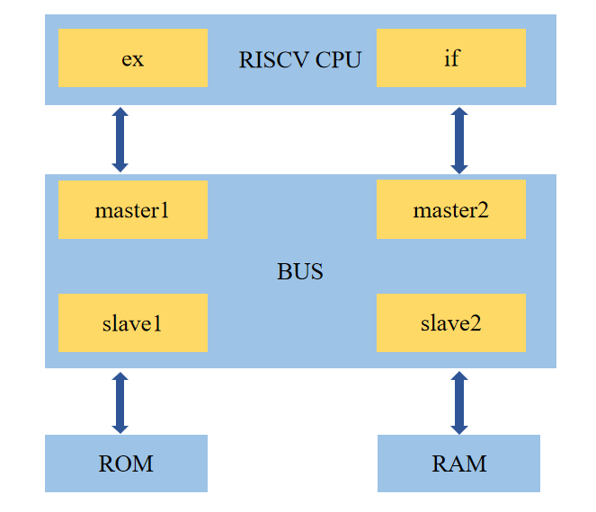

### 3.1、顶层模块的实现：

顶层模块在ricsv.v中实现，主要内容就是对上面实现的流水线各个尖端的模块进行例化与连接。至此ori指令的流水线已经结束。

riscv.v

```verilog
`include "defines.v"

// riscv处理器核顶层模块
module riscv(

    input wire clk,
    input wire rst,

    output wire[`MemAddrBus] bus_ex_addr_o,    // 读、写外设的地址
    input wire[`MemBus] bus_ex_data_i,         // 从外设读取的数据
    output wire[`MemBus] bus_ex_data_o,        // 写入外设的数据
    output wire bus_ex_req_o,                  // 访问外设请求
    output wire bus_ex_we_o,                   // 写外设标志

    output wire[`MemAddrBus] bus_pc_addr_o,    // 取指地址
    input wire[`MemBus] bus_pc_data_i         // 取到的指令内容
    );

    // pc_reg模块输出信号
	wire[`InstAddrBus] pc_pc_o;

    // if_id模块输出信号
	wire[`InstBus] if_inst_o;
    wire[`InstAddrBus] if_inst_addr_o;

    // id模块输出信号
    wire[`RegAddrBus] id_reg1_raddr_o;
    wire[`RegAddrBus] id_reg2_raddr_o;
    wire[`InstBus] id_inst_o;
    wire[`InstAddrBus] id_inst_addr_o;
    wire[`RegBus] id_reg1_rdata_o;
    wire[`RegBus] id_reg2_rdata_o;
    wire id_reg_we_o;
    wire[`RegAddrBus] id_reg_waddr_o;
    wire[`MemAddrBus] id_op1_o;
    wire[`MemAddrBus] id_op2_o;


    // id_ex模块输出信号
    wire[`InstBus] ie_inst_o;
    wire[`InstAddrBus] ie_inst_addr_o;
    wire ie_reg_we_o;
    wire[`RegAddrBus] ie_reg_waddr_o;
    wire[`RegBus] ie_reg1_rdata_o;
    wire[`RegBus] ie_reg2_rdata_o;

    wire[`MemAddrBus] ie_op1_o;
    wire[`MemAddrBus] ie_op2_o;

    // ex模块输出信号
    wire[`MemBus] ex_mem_wdata_o;
    wire[`MemAddrBus] ex_mem_raddr_o;
    wire[`MemAddrBus] ex_mem_waddr_o;
    wire ex_mem_we_o;
    wire ex_mem_req_o;
    wire[`RegBus] ex_reg_wdata_o;
    wire ex_reg_we_o;
    wire[`RegAddrBus] ex_reg_waddr_o;


    // regs模块输出信号
    wire[`RegBus] regs_rdata1_o;
    wire[`RegBus] regs_rdata2_o;


    assign bus_ex_addr_o = (ex_mem_we_o == `WriteEnable)? ex_mem_waddr_o: ex_mem_raddr_o;
    assign bus_ex_data_o = ex_mem_wdata_o;
    assign bus_ex_req_o = ex_mem_req_o;
    assign bus_ex_we_o = ex_mem_we_o;
    assign bus_pc_addr_o = pc_pc_o;


    // pc_reg模块例化
    pc_reg u_pc_reg(
        .clk(clk),
        .rst(rst),
        .pc_o(pc_pc_o)
    );


    // regs模块例化
    regs u_regs(
        .clk(clk),
        .rst(rst),
        .we_i(ex_reg_we_o),
        .waddr_i(ex_reg_waddr_o),
        .wdata_i(ex_reg_wdata_o),
        .raddr1_i(id_reg1_raddr_o),
        .rdata1_o(regs_rdata1_o),
        .raddr2_i(id_reg2_raddr_o),
        .rdata2_o(regs_rdata2_o)
    );


    // if_id模块例化
    if_id u_if_id(
        .clk(clk),
        .rst(rst),
        .inst_i(bus_pc_data_i),
        .inst_addr_i(pc_pc_o),
        .inst_o(if_inst_o),
        .inst_addr_o(if_inst_addr_o)
    );

    // id模块例化
    id u_id(
        .rst(rst),
        .inst_i(if_inst_o),
        .inst_addr_i(if_inst_addr_o),
        .reg1_rdata_i(regs_rdata1_o),
        .reg2_rdata_i(regs_rdata2_o),
        .reg1_raddr_o(id_reg1_raddr_o),
        .reg2_raddr_o(id_reg2_raddr_o),
        .inst_o(id_inst_o),
        .inst_addr_o(id_inst_addr_o),
        .reg1_rdata_o(id_reg1_rdata_o),
        .reg2_rdata_o(id_reg2_rdata_o),
        .reg_we_o(id_reg_we_o),
        .reg_waddr_o(id_reg_waddr_o),
        .op1_o(id_op1_o),
        .op2_o(id_op2_o)
    );

    // id_ex模块例化
    id_ex u_id_ex(
        .clk(clk),
        .rst(rst),
        .inst_i(id_inst_o),
        .inst_addr_i(id_inst_addr_o),
        .reg_we_i(id_reg_we_o),
        .reg_waddr_i(id_reg_waddr_o),
        .reg1_rdata_i(id_reg1_rdata_o),
        .reg2_rdata_i(id_reg2_rdata_o),
        .inst_o(ie_inst_o),
        .inst_addr_o(ie_inst_addr_o),
        .reg_we_o(ie_reg_we_o),
        .reg_waddr_o(ie_reg_waddr_o),
        .reg1_rdata_o(ie_reg1_rdata_o),
        .reg2_rdata_o(ie_reg2_rdata_o),
        .op1_i(id_op1_o),
        .op2_i(id_op2_o),
        .op1_o(ie_op1_o),
        .op2_o(ie_op2_o)
    );

    // ex模块例化
    ex u_ex(
        .rst(rst),
        .inst_i(ie_inst_o),
        .inst_addr_i(ie_inst_addr_o),
        .reg_we_i(ie_reg_we_o),
        .reg_waddr_i(ie_reg_waddr_o),
        .reg1_rdata_i(ie_reg1_rdata_o),
        .reg2_rdata_i(ie_reg2_rdata_o),
        .op1_i(ie_op1_o),
        .op2_i(ie_op2_o),
        .mem_rdata_i(bus_ex_data_i),
        .mem_wdata_o(ex_mem_wdata_o),
        .mem_raddr_o(ex_mem_raddr_o),
        .mem_waddr_o(ex_mem_waddr_o),
        .mem_we_o(ex_mem_we_o),
        .mem_req_o(ex_mem_req_o),
        .reg_wdata_o(ex_reg_wdata_o),
        .reg_we_o(ex_reg_we_o),
        .reg_waddr_o(ex_reg_waddr_o)
    );


endmodule

```


### 3.2、rom、ram与总线bus	

​		在验证riscv实现效果前，需要实现指令存储器及总线的设计，以便riscv从中读取指令。

指令存储器rom的实现：

 rom.v

```verilog
`include "defines.v"

module rom(

    input wire clk,
    input wire rst,

    input wire we_i,                   // write enable
    input wire[`MemAddrBus] addr_i,    // addr
    input wire[`MemBus] data_i,

    output reg[`MemBus] data_o         // read data

    );

    reg[`MemBus] _rom[0:`RomNum - 1];

    always @ (posedge clk) begin
        if (we_i == `WriteEnable) begin
            _rom[addr_i[31:2]] <= data_i;
        end
    end

    always @ (*) begin
        if (rst == `RstEnable) begin
            data_o = `ZeroWord;
        end else begin
            data_o = _rom[addr_i[31:2]];
        end
    end

endmodule
```

ram.v

```verilog
`include "defines.v"

// ram module
module ram(
    input wire clk,
    input wire rst,
    input wire we_i,                   // write enable
    input wire[`MemAddrBus] addr_i,    // addr
    input wire[`MemBus] data_i,

    output reg[`MemBus] data_o         // read data
    );

    reg[`MemBus] _ram[0:`MemNum - 1];


    always @ (posedge clk) begin
        if (we_i == `WriteEnable) begin
            _ram[addr_i[31:2]] <= data_i;
        end
    end

    always @ (*) begin
        if (rst == `RstEnable) begin
            data_o = `ZeroWord;
        end else begin
            data_o = _ram[addr_i[31:2]];
        end
    end

endmodule

```

bus.v

```verilog
`include "defines.v"

// RIB总线模块
module bus(

    input wire clk,
    input wire rst,

    // master 0 interface
    input wire[`MemAddrBus] m0_addr_i,     // 主设备0读、写地址
    input wire[`MemBus] m0_data_i,         // 主设备0写数据
    output reg[`MemBus] m0_data_o,         // 主设备0读取到的数据
    input wire m0_req_i,                   // 主设备0访问请求标志
    input wire m0_we_i,                    // 主设备0写标志
    
    // master 1 interface
    input wire[`MemAddrBus] m1_addr_i,     // 主设备1读、写地址
    input wire[`MemBus] m1_data_i,         // 主设备1写数据
    output reg[`MemBus] m1_data_o,         // 主设备1读取到的数据
    input wire m1_req_i,                   // 主设备1访问请求标志
    input wire m1_we_i,                    // 主设备1写标志

    // slave 0 interface
    output reg[`MemAddrBus] s0_addr_o,     // 从设备0读、写地址
    output reg[`MemBus] s0_data_o,         // 从设备0写数据
    input wire[`MemBus] s0_data_i,         // 从设备0读取到的数据
    output reg s0_we_o,                    // 从设备0写标志
    
    // slave 1 interface
    output reg[`MemAddrBus] s1_addr_o,     // 从设备1读、写地址
    output reg[`MemBus] s1_data_o,         // 从设备1写数据
    input wire[`MemBus] s1_data_i,         // 从设备1读取到的数据
    output reg s1_we_o                     // 从设备1写标志
    );


    // 访问地址的最高4位决定要访问的是哪一个从设备
    // 因此最多支持16个从设备
    parameter [3:0]slave_0 = 4'b0000;
    parameter [3:0]slave_1 = 4'b0001;
    parameter [1:0]grant0 = 2'h0;
    parameter [1:0]grant1 = 2'h1;

    wire[3:0] req;
    reg[1:0] grant;
    
    // 主设备请求信号
    assign req = {m1_req_i,m0_req_i};

    // 仲裁逻辑
    // 固定优先级仲裁机制
    always @ (*) begin
        if (req[0]) begin
            grant = grant0;
        end else begin
            grant = grant1;
        end
    end

    // 根据仲裁结果，选择(访问)对应的从设备
    always @ (*) begin
        m0_data_o = `ZeroWord;
        m1_data_o = `INST_NOP;
        s0_addr_o = `ZeroWord;
        s1_addr_o = `ZeroWord;
        s0_data_o = `ZeroWord;
        s1_data_o = `ZeroWord;
        s0_we_o = `WriteDisable;
        s1_we_o = `WriteDisable;
        case (grant)
            grant0: begin
                case (m0_addr_i[31:28])
                    slave_0: begin
                        s0_we_o = m0_we_i;
                        s0_addr_o = {{4'h0}, {m0_addr_i[27:0]}};
                        s0_data_o = m0_data_i;
                        m0_data_o = s0_data_i;
                    end
                    slave_1: begin
                        s1_we_o = m0_we_i;
                        s1_addr_o = {{4'h0}, {m0_addr_i[27:0]}};
                        s1_data_o = m0_data_i;
                        m0_data_o = s1_data_i;
                    end
                    default: begin
                    end
                endcase
            end
            grant1: begin
                case (m1_addr_i[31:28])
                    slave_0: begin
                        s0_we_o = m1_we_i;
                        s0_addr_o = {{4'h0}, {m1_addr_i[27:0]}};
                        s0_data_o = m1_data_i;
                        m1_data_o = s0_data_i;
                    end
                    slave_1: begin
                        s1_we_o = m1_we_i;
                        s1_addr_o = {{4'h0}, {m1_addr_i[27:0]}};
                        s1_data_o = m1_data_i;
                        m1_data_o = s1_data_i;
                    end
                    default: begin
                    end
                endcase
            end
            default: begin
            end
        endcase
    end

endmodule

```


### 3.3、SoC的实现

为了验证，需要建立一个SoC，其中仅包含riscv、指令存储器rom、数据村暑期ram及总线bus，其结构如下：

 

 

```verilog
`include "defines.v"

// riscv soc
module riscv_soc_top(
    input wire clk,
    input wire rst
    );

    // master 0 interface
    wire[`MemAddrBus] m0_addr_i;
    wire[`MemBus] m0_data_i;
    wire[`MemBus] m0_data_o;
    wire m0_req_i;
    wire m0_we_i;
    
    // master 1 interface
    wire[`MemAddrBus] m1_addr_i;
    wire[`MemBus] m1_data_i;
    wire[`MemBus] m1_data_o;
    wire m0_req_i;
    wire m0_we_i;

    // slave 0 interface
    wire[`MemAddrBus] s0_addr_o;
    wire[`MemBus] s0_data_o;
    wire[`MemBus] s0_data_i;
    wire s0_we_o;
    
    // slave 1 interface
    wire[`MemAddrBus] s1_addr_o;
    wire[`MemBus] s1_data_o;
    wire[`MemBus] s1_data_i;
    wire s1_we_o;

    // tinyriscv模块
    riscv u_riscv(
        .clk(clk),
        .rst(rst),
        .bus_ex_addr_o(m0_addr_i),
        .bus_ex_data_i(m0_data_o),
        .bus_ex_data_o(m0_data_i),
        .bus_ex_req_o(m0_req_i),
        .bus_ex_we_o(m0_we_i),

        .bus_pc_addr_o(m1_addr_i),
        .bus_pc_data_i(m1_data_o)
    );

    // rom模块
    rom u_rom(
        .clk(clk),
        .rst(rst),
        .we_i(s0_we_o),
        .addr_i(s0_addr_o),
        .data_i(s0_data_o),
        .data_o(s0_data_i)
    );
    
    // ram模块
    ram u_ram(
        .clk(clk),
        .rst(rst),
        .we_i(s1_we_o),
        .addr_i(s1_addr_o),
        .data_i(s1_data_o),
        .data_o(s1_data_i)
    );


    // bus总线
    bus u_bus(
        .clk(clk),
        .rst(rst),

        // master 0 interface
        .m0_addr_i(m0_addr_i),
        .m0_data_i(m0_data_i),
        .m0_data_o(m0_data_o),
        .m0_req_i(m0_req_i),
        .m0_we_i(m0_we_i),
        
        // master 1 interface
        .m1_addr_i(m1_addr_i),
        .m1_data_i(`ZeroWord),
        .m1_data_o(m1_data_o),
        .m1_req_i(`BUS_REQ),
        .m1_we_i(`WriteDisable),

        // slave 0 interface
        .s0_addr_o(s0_addr_o),
        .s0_data_o(s0_data_o),
        .s0_data_i(s0_data_i),
        .s0_we_o(s0_we_o),
        
        // slave 1 interface
        .s1_addr_o(s1_addr_o),
        .s1_data_o(s1_data_o),
        .s1_data_i(s1_data_i),
        .s1_we_o(s1_we_o)
    );


endmodule


```

 

### 3.4、编写测试程序：

为了验证需要编写一段测试程序，并将其存储到指令存储器rom中，当SoC开始运行是，就会从rom中取出程序，送入riscv处理器执行。程序的汇编语言如下：

```
ori $1,$0,0x110
ori $2,$0,0xff0
ori $3,$1,0x001
ori $4,$2,0x00f
```

第一条指令将0x110进行零扩展后与寄存器$0进行逻辑或运算，结果保存在寄存器$1中。

第二条指令将0xff0进行零扩展后与寄存器$0进行逻辑或运算，结果保存在寄存器$2中。

第三条指令将0x001进行零扩展后与寄存器$1进行逻辑或运算，结果保存在寄存器$3中。

第四条指令将0x00f进行零扩展后与寄存器$2进行逻辑或运算，结果保存在寄存器$4中。

 

Opcode=0010011

Funct3=110

所以以上四条指令对应的机器码为：

```
0001_0001_0000_0000_0110_0000_1001_0011 0h1100_6093
1111_1111_0000_0000_0110_0001_0001_0011 0hff00_6113
0000_0000_0001_0000_1110_0001_1001_0011 0h0010_e193
0000_0000_1111_0001_0110_0010_0001_0011 0h00f1_6213
```

建立test bench文件，其中给出最小SoC运行所需的时钟信号、复位信号。使用vivado验证波形如下：

 

 

```Verilog
`timescale 1ns / 1ps

`include "defines.v"

// testbench module
module riscv_soc_tb;
    reg clk;
    reg rst;

	always #10 clk = ~clk;     // 50MHz
    
    initial begin
        clk = 0;
        rst = `RstEnable;
        $display("test running...");
        #30
        rst = #1 `RstDisable;
        #500
        $display("Time Out.");
        $finish;
    end

    // read mem data
    initial begin
        $readmemh ("D:/vivado/examples/RISCV_by_me/RISCV_by_me.srcs/OR.txt", riscv_soc_top_0.u_rom._rom);
    end

    // generate wave file, used by gtkwave
    initial begin
        $dumpfile("riscv_soc_tb.vcd");
        $dumpvars(0, riscv_soc_tb);
    end

    riscv_soc_top riscv_soc_top_0(
        .clk(clk),
        .rst(rst)
    );

endmodule

```


### 3.4、流水线数据相关问题：

数据相关，指的是在流水线执行的几条指令中，一条指令依赖于前面指令执行的结果。可以采用插入暂停周期来消除数据相关。


